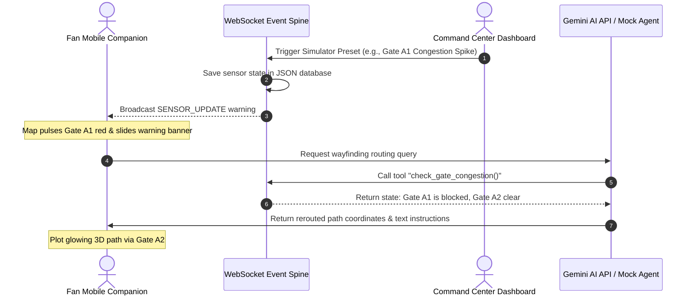

# Nexus26 — FIFA World Cup 2026 AI Operations Brain
### Hac2Skill Vibe Coding Submission | Built with Gemini API, WebSockets & Three.js

---

## One-Line Pitch
**Nexus26 is a bilingual pair of GenAI surfaces — a fan-facing multilingual navigation companion and a command-center intelligence dashboard — both powered by the same Gemini function-calling backbone, so a single live signal (a gate sensor spike, a delayed subway train) simultaneously reroutes fans and alerts staff in real time.**

---

## System Architecture



---

## Repository Hierarchy

<details>
<summary>Click to expand project folder structure</summary>

```
nexus26/
├── data/                            # Mock Database File Spine
│   ├── accessibility_routes.json    # Wheelchair ramp & rideshare locations
│   ├── fifa_compliance_manual.md    # Compliance regulations manual
│   ├── gate_sensors.json            # Dynamic gate queue wait times
│   ├── stadium_map_coords.json      # Coordinate systems for stadium sections
│   ├── transit_feeds.json           # Live transit delayed schedule updates
│   └── volunteer_reports.json       # Log of open/dispatched incident reports
├── public/                          # Frontend Static Assets
│   ├── css/
│   │   └── style.css                # Enterprise design system stylesheet
│   ├── js/
│   │   ├── command.js               # Staff dashboard handlers and simulator
│   │   ├── fan.js                   # Mobile wayfinding, voice & digital ticket
│   │   └── stadium3d.js             # Procedural 3D WebGL renderer (Three.js)
│   ├── command.html                 # Staff Command Dashboard
│   ├── fan.html                     # Mobile Fan Companion View
│   └── index.html                   # Submission Gateway Portal
├── .editorconfig                # Cross-editor formatting consistency
├── .eslintrc.json                   # ESLint code quality configuration
├── .prettierrc                      # Prettier formatting configuration
├── jest.config.js                   # Jest test configuration with coverage thresholds
├── package.json                     # Dependency manifests & startup scripts
├── server.js                        # Node/Express backend & WebSocket Spine
├── server.test.js                   # Jest unit test suite (36 assertions)
└── test_queries.js                  # Automated CLI integration test suite
```
</details>

---

## System Features

| Feature | Surface | Description | Technical Stack |
| :--- | :--- | :--- | :--- |
| **Interactive 3D WebGL Map** | Fan & Command | Procedurally rendered 3D stadium bowl with OrbitControls (drag to rotate, scroll to zoom, right-click to pan). Paths draw as glowing 3D tubes. | Three.js / WebGL / HTML Canvas |
| **Real-time Congestion Rerouting** | Fan Mobile | Triggering a gate congestion spike instantly alerts active fans with warning banners and redraws path lines. | WebSockets / SVG / Canvas |
| **Digital Ticket Integration** | Fan Mobile | Collapsible match ticket card. Click "Scan & Route" to automatically plot paths from transit hubs into stand sections. | HTML / Javascript |
| **Voice Translation Guide** | Fan Mobile | Speech recognition and translation guides. Speaks back wayfinding directions in Spanish, French, German, or English. | Web Speech Web API |
| **Operations KPI Stats Ribbon** | Command Center | Summary stats cards showing average gate queues, open incidents queue, and active ground volunteer counts. | HTML / CSS Grid / JS |
| **Quick Demo Presets** | Command Center | Simulator buttons to trigger Gate surges, Waste spills, or Transit delays in one click. | REST API / WebSockets |

---

## Installation & Local Startup

<details>
<summary>Click to expand local setup instructions</summary>

### Prerequisites
- Node.js (version 18 or above)
- npm (Node Package Manager)

### 1. Install Dependencies
Open a terminal in the root directory and run:
```bash
npm install
```

### 2. Configure Environment variables (Optional)
Copy `.env.example` to `.env` and add your Gemini API Key:
```bash
cp .env.example .env
```
Inside `.env`:
```env
PORT=3000
GEMINI_API_KEY=your_actual_gemini_api_key_here
```
*Note: If no key is configured, the application automatically runs in Fallback Mock-Agent Mode with full conversational wayfinding and query support.*

### 3. Run the Application
Start the server:
```bash
npm start
```
The console will log:
```
=======================================================
 Nexus26 - World Cup Operations Spine Server
 Running on: http://localhost:3000
 WebSocket Spine: ws://localhost:3000
=======================================================
```
Open [http://localhost:3000](http://localhost:3000) to view the portal entry gateway!
</details>

---

## Live Demo Test Script

<details>
<summary>Click to expand step-by-step presentation steps</summary>

Arrange two browser windows side-by-side:
- **Window 1 (Mobile Fan)**: Open [http://localhost:3000/fan.html](http://localhost:3000/fan.html)
- **Window 2 (Dashboard)**: Open [http://localhost:3000/command.html](http://localhost:3000/command.html)

### Step 1: Render the 3D Stadium
1. In both views, click **3D Model** on the Navigation View selectors.
2. **Result**: The flat blueprint is replaced with a WebGL canvas rendering a 3D stadium bowl. Click and drag to spin the stadium. Scroll to zoom inside the bowl and see the grass pitch.

### Step 2: Auto-Route the Match Ticket
1. In the Fan view (Window 1), click **Digital Match Ticket** at the top -> **Scan & Route**.
2. **Result**: A glowing cyan 3D tube path is plotted. It starts at the Transit station ring, walks on the grass perimeter to Gate A1, and climbs up the stairs of the stands to Section 102!

### Step 3: Trigger a Gate Surge Alert
1. In the Command view (Window 2), go to **Quick Scenario Presets** and click **1. Gate Surge**.
2. **Result**: 
   - Gate A1 flashes red and pulses on both maps.
   - The Fan companion (Window 1) slides down a red warning banner.
   - The path line on the map **instantly redraws in red to navigate via Gate A2 instead**, updating the spoken instructions.

### Step 4: Toggle Map Layers & Dispatch Volunteers
1. In the Command view (Window 2), click **2. Trash Hazard** on the presets board.
2. **Result**: 
   - Stand circle **S118** highlights in amber on the heatmap.
   - The active map layer automatically swaps to **Waste** so staff can identify the location.
3. In the live alerts feed, click **Dispatch Volunteer** on the newly created ticket. The status changes to "En Route" and a dispatch notification is pushed to the Fan companion.
</details>

## Automated Testing

### Jest Unit Test Suite (36 assertions)
Run the full test suite with:
```bash
npm test
```

Run with coverage enforcement:
```bash
npm run test:coverage
```
The suite validates:
- All REST API endpoints (GET/POST) with correct status codes
- Input validation (400 responses for missing/invalid fields)
- 404 handling for non-existent resources and unknown endpoints
- XSS injection sanitization (verifies `<script>` tags are escaped)
- Volunteer dispatch lifecycle (create report → assign volunteer)
- Chat fallback agent responses for both fan and command personas

### CLI Integration Test
While the server is running, execute the integration test:
```bash
node test_queries.js
```

---

## Code Quality Standards

| Standard | Implementation |
|---|---|
| **Linting** | ESLint configured (`.eslintrc.json`) with `eslint:recommended`. Run: `npm run lint` |
| **Formatting** | Prettier (`.prettierrc`) + EditorConfig (`.editorconfig`) for cross-editor consistency |
| **Coverage Gates** | Jest coverage thresholds enforced in `jest.config.js` (70% stmts, 60% branches) |
| **JSDoc** | All functions, routes, and modules annotated with `@param`/`@returns` |
| **Strict Mode** | `'use strict'` enforced across all JS files |
| **Structured Logging** | Timestamped `[ISO] [LEVEL] [MODULE]` format via `log()` utility |
| **Input Validation** | All POST endpoints validate required fields with 400 responses |
| **Error Handling** | Global 404 handler + centralized error middleware |
| **Environment Validation** | Startup check logs config state and warns on missing keys |

---

## Security Architecture

| Layer | Protection |
|---|---|
| **HTTP Headers** | X-Frame-Options, X-Content-Type-Options, Referrer-Policy, Permissions-Policy |
| **HSTS** | Strict-Transport-Security with 1-year max-age |
| **CSP** | Whitelist-only Content-Security-Policy with `frame-ancestors 'none'` |
| **CORS** | Strict origin whitelist (Render deployment + localhost only) |
| **XSS Sanitization** | HTML entity escaping on all user-supplied POST body strings |
| **Rate Limiting** | 180 requests/minute per IP sliding window |
| **Body Size Limit** | 100kb max JSON payload to prevent DoS |
| **Path Traversal** | Whitelist-only file access (`ALLOWED_FILES` array) |

---

## API Reference

| Method | Endpoint | Description |
|---|---|---|
| `GET` | `/api/sensors` | Live gate congestion sensor data |
| `POST` | `/api/sensors/update` | Update gate congestion level |
| `GET` | `/api/transit` | Transit line schedule and delays |
| `POST` | `/api/transit/update` | Update transit line delay |
| `GET` | `/api/reports` | All volunteer incident reports |
| `POST` | `/api/reports` | File a new incident report |
| `POST` | `/api/dispatch` | Assign volunteer to a report |
| `POST` | `/api/broadcast` | Send emergency broadcast |
| `POST` | `/api/reset` | Reset all data to defaults |
| `POST` | `/api/chat/:persona` | AI chat (fan or command) |
